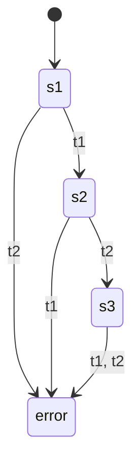
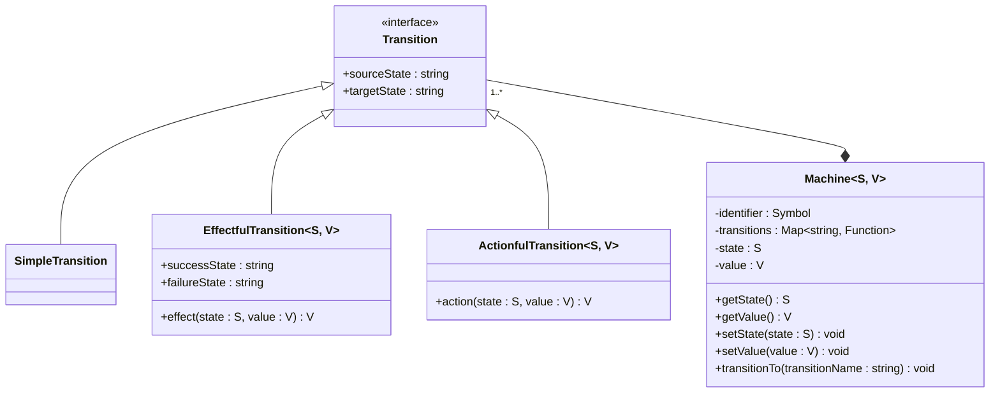
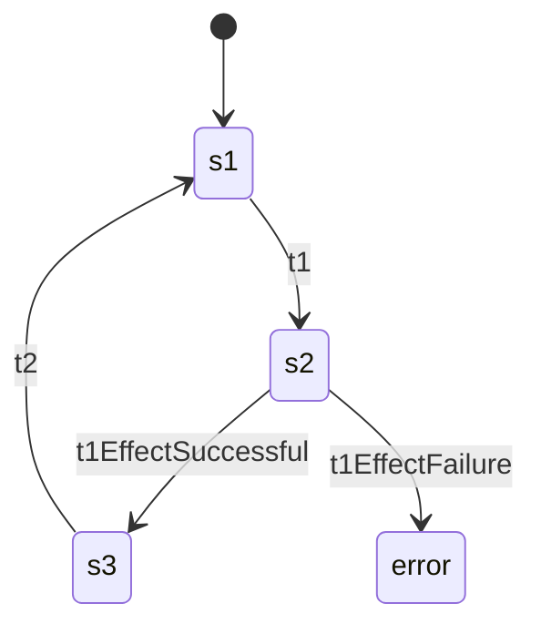

# Design Philosophy

## A Simple Example 

The following DFA



with:

```
Q = {s1, s2, s3, error}
q0 = s1
Σ = {t1, t2}
F = {}
δ is defined by the following state transition table:
```

|           | t1    | t2    |
|-----------|-------|-------|
| **s1**    | s2    | error |
| **s2**    | error | s3    |
| **s3**    | error | error |
| **error** | error | error |

can be constructed using `yugen` with the following code:

```ts
const m = createMachine({
  state: 's1',
  value: null,
  transitions: {
    t1: {
      sourceState: 's1',
      targetState: 's2',
    },
    t2: {
      sourceState: 's2',
      targetState: 's3'
    }
  }
})
```

Note that `createMachine` also needs a `value` which is not possible with DFAs.
Because DFAs don't have an extra memory unlike [PDAs](https://en.wikipedia.org/wiki/Pushdown_automaton) and [Turing Machines](https://en.wikipedia.org/wiki/Turing_machine).

The transitions in `yugen` however follow strictly the concept of DFAs.

> [!IMPORTANT]
> Moving forward, only "legal" transitions will be drawn in diagrams. Assume transitions that are not
> drawn leading to an "error" state which also will not be drawn.

## Internals of a machine



## Effectful transitions



```ts
const m = createMachine({
  state: 's1',
  value: null,
  transitions: {
    t1: {
      sourceState: 's1',
      targetState: 's2',
      effect: (_state, _value) => null,
      successState: 's3',
      failureState: 'error',
    },
    t2: {
      sourceState: 's3',
      targetState: 's1'
    }
  }
})
```

Transitions `t1EffectSuccessful` and `t1EffectFailure` are auto-generated and get called asynchronously after the
`effect` function has returned the next `value`.