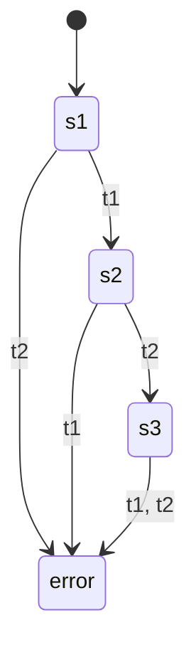
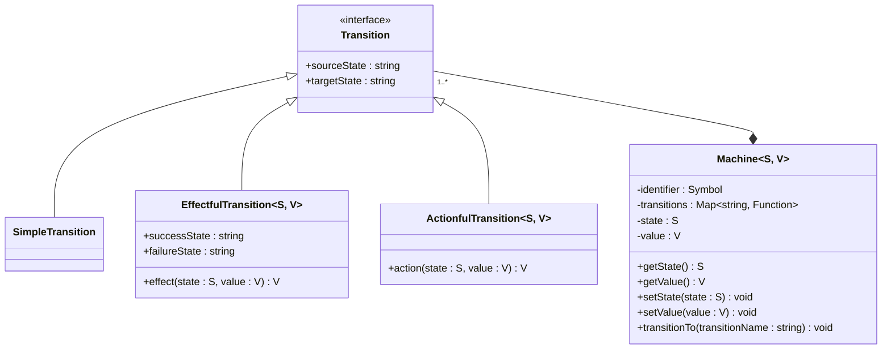
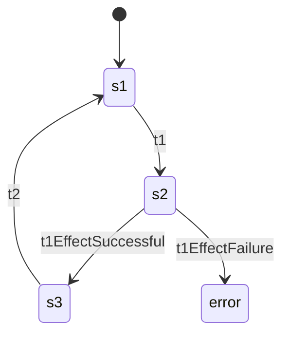
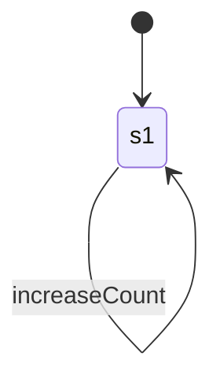

# Design Philosophy

## A Simple Example 

The following DFA



with:

$Q = \{s1, s2, s3, error\}$ <br />
$q0 = s1$ <br />
$\Sigma = \{t1, t2\}$ <br />
$F = \{\}$ <br />
$\delta$ is defined by the following state transition table:

|           | t1    | t2    |
|-----------|-------|-------|
| **s1**    | s2    | error |
| **s2**    | error | s3    |
| **s3**    | error | error |
| **error** | error | error |

can be constructed using `yugen` with the following code:

```TypeScript
const m = createMachine({
  state: 's1',
  value: null,
  transitions: {
    t1: {
      sourceState: 's1',
      targetState: 's2',
    },
    t2: {
      sourceState: 's2',
      targetState: 's3'
    }
  }
})

```
> [!INFO]
> Note that `createMachine` also needs a `value` which is not possible with DFAs.
> Because DFAs don't have an extra memory unlike [PDAs](https://en.wikipedia.org/wiki/Pushdown_automaton) and [Turing Machines](https://en.wikipedia.org/wiki/Turing_machine).

The transitions in `yugen` however follow strictly the concept of DFAs. Therefore, they are the most curial
part of a store. It is not possible to assign the same transition to multiple states by design. Consequently,
you must declare more descriptive transitions based on the `sourceState`. It also helps keeping the store simple.

> [!IMPORTANT]
> Moving forward, only "legal" transitions will be drawn in diagrams. Assume transitions that are not
> drawn leading to an "error" state which also will not be drawn.

## Internals of a machine



## Effectful transitions

In real world applications you certainly will fetch some data from an API. For asynchronous operations like this,
you can create _effectful_ transitions. To do so, you have to pass three additional properties to a transition.
`effect` property is a function, that takes the `state` as first argument and the `value` as second argument and returns 
a `Promise` containing the new value. Once the transitions is triggered, the machine transitions to `targetState`.
After the resolution of the Promise returned by `effect`, the machine either transitions to `successState` or `failureState`.

If the `Promise` rejects or the `TRANSITION_FAILURE` primitive is returned, the machine transitions to `failureState`.

```TypeScript
const m = createMachine({
  state: 's1',
  value: null,
  transitions: {
    t1: {
      sourceState: 's1',
      targetState: 's2',
      effect: (_state, _value) => null,
      successState: 's3',
      failureState: 'error',
    },
    t2: {
      sourceState: 's3',
      targetState: 's1'
    }
  }
})
```



> [!INFO]
> Transitions `t1EffectSuccessful` and `t1EffectFailure` are auto-generated and get called asynchronously after the
> `effect` function has returned the next `value`.

## Actionful transitions

Often we want to manipulate a piece of state synchronously. _Actionful_ transitions can be used to accomplish this.
The additional _action_ property defines a function that takes the current `state` and `value` as arguments and returns 
the next `value`. The machine transitions to `targetState` once the `action` has returned. Note that this happens the other 
way around for _effectful_ transitions.

```TypeScript
const m = createMachine({
  state: 's1',
  value: 0,
  transitions: {
    increaseCount: {
      sourceState: 's1',
      targetState: 's1',
      action: (_state, value) => value + 1,
    }
  }
})
```


