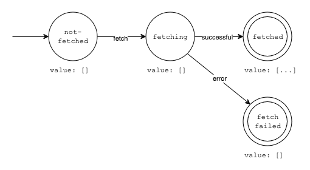

# Yugen: A framework agnostic, lightweight, robust and intuitive state manager

> 有限 / _Yūgen_: japanese for finite, as in _deterministic finite automaton_

Yugen models state management as a [deterministic finite automaton](https://en.wikipedia.org/wiki/Deterministic_finite_automaton). Below is the state machine for a `TodoStore`, which fetches todos.

## Why

Over the past years I observerd that state management in frontend can be quite complex and prone for error. This is why `Yugen` was born as part of my bachelors thesis. Beside the source code, you will also find my thesis here. It includes the design decisions and a comparison to other state management libraries.
